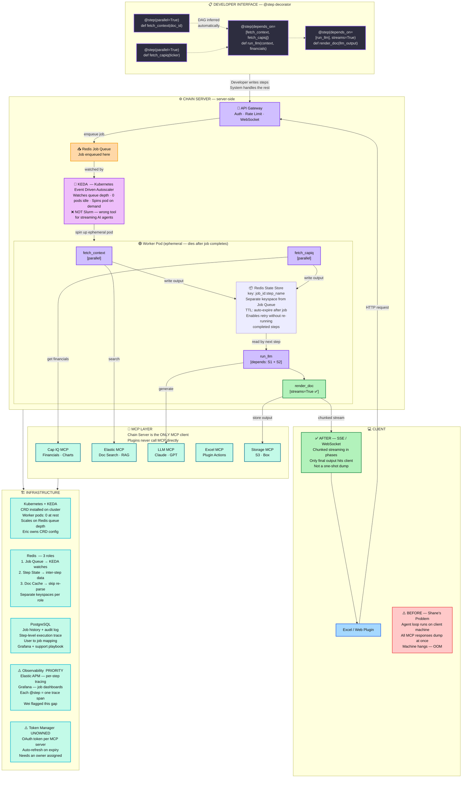

# AgentOrchestrator — Architecture Overview

```mermaid
flowchart TD
    subgraph DEV["📋 DEVELOPER INTERFACE — @step decorator"]
        direction LR
        C1["@step(parallel=True)\ndef fetch_context(doc_id)"]
        C2["@step(parallel=True)\ndef fetch_capiq(ticker)"]
        C3["@step(depends_on=[fetch_context, fetch_capiq])\ndef run_llm(context, financials)"]
        C4["@step(depends_on=[run_llm], streams=True)\ndef render_doc(llm_output)"]
        C1 -.->|"DAG inferred\nautomatically"| C3
        C2 -.-> C3
        C3 -.-> C4
    end

    DEV -->|"Developer writes steps\nSystem handles the rest"| GW

    subgraph CHAIN["⚙️ CHAIN SERVER  —  server-side"]
        direction TB

        GW["🔀 API Gateway\nAuth · Rate Limit · WebSocket"]

        GW -->|"enqueue job"| QUEUE

        QUEUE["📥 Redis Job Queue\nJob enqueued here"]
        KEDA["📡 KEDA  — Kubernetes Event Driven Autoscaler\nWatches queue depth · 0 pods idle · Spins pod on demand\n❌ NOT Slurm — wrong tool for streaming AI agents"]

        QUEUE -->|"watched by"| KEDA
        KEDA -->|"spin up ephemeral pod"| WORKER

        subgraph WORKER["🟣 Worker Pod  (ephemeral — dies after job completes)"]
            direction TB
            S1["fetch_context\n[parallel]"]
            S2["fetch_capiq\n[parallel]"]
            S3["run_llm\n[depends: S1 + S2]"]
            S4["render_doc\n[streams=True ✅]"]

            S1 -->|"write output"| RSTATE
            S2 -->|"write output"| RSTATE
            RSTATE -->|"read by next step"| S3
            S3 --> S4

            RSTATE["📦 Redis State Store\nkey: job_id:step_name\nSeparate keyspace from Job Queue\nTTL: auto-expire after job\nEnables retry without re-running\ncompleted steps"]
        end
    end

    subgraph CLIENT["💻 CLIENT"]
        direction TB
        PLUGIN["Excel / Web Plugin"]

        BEFORE["⚠️ BEFORE — Shane's Problem\nAgent loop runs on client machine\nAll MCP responses dump at once\nMachine hangs — OOM"]

        SSE["✅ AFTER — SSE / WebSocket\nChunked streaming in phases\nOnly final output hits client\nNot a one-shot dump"]
    end

    subgraph MCP["🔌 MCP LAYER\nChain Server is the ONLY MCP client\nPlugins never call MCP directly"]
        direction LR
        MCPCIQ["Cap IQ MCP\nFinancials · Charts"]
        MCPELAS["Elastic MCP\nDoc Search · RAG"]
        MCPLLM["LLM MCP\nClaude · GPT"]
        MCPEXCEL["Excel MCP\nPlugin Actions"]
        MCPS3["Storage MCP\nS3 · Box"]
    end

    subgraph INFRA["🏗️ INFRASTRUCTURE"]
        direction LR
        K8S["Kubernetes + KEDA\nCRD installed on cluster\nWorker pods: 0 at rest\nScales on Redis queue depth\nEric owns CRD config"]
        REDIS["Redis  — 3 roles\n1. Job Queue → KEDA watches\n2. Step State → inter-step data\n3. Doc Cache → skip re-parse\nSeparate keyspaces per role"]
        PG["PostgreSQL\nJob history + audit log\nStep-level execution trace\nUser to job mapping\nGrafana + support playbook"]
        OBS["⚠️ Observability  PRIORITY\nElastic APM — per-step tracing\nGrafana — job dashboards\nEach @step = one trace span\nWei flagged this gap"]
        TOKEN["⚠️ Token Manager  UNOWNED\nOAuth token per MCP server\nAuto-refresh on expiry\nNeeds an owner assigned"]
    end

    %% Client flow
    PLUGIN -->|"HTTP request"| GW
    S4 -->|"chunked stream"| SSE
    SSE --> PLUGIN

    %% MCP calls from worker steps
    S1 -->|"search"| MCPELAS
    S2 -->|"get financials"| MCPCIQ
    S3 -->|"generate"| MCPLLM
    S4 -->|"store output"| MCPS3

    %% Infra sits below everything
    CHAIN --> INFRA
    MCP --> INFRA

    %% Styling
    classDef problem fill:#ffc9c9,stroke:#ef4444,stroke-width:2px,color:#111
    classDef solution fill:#b2f2bb,stroke:#15803d,stroke-width:2px,color:#111
    classDef step fill:#d0bfff,stroke:#7c3aed,stroke-width:2px,color:#111
    classDef mcp fill:#c3fae8,stroke:#0e7490,stroke-width:2px,color:#111
    classDef queue fill:#ffd8a8,stroke:#f59e0b,stroke-width:2px,color:#111
    classDef warn fill:#eebefa,stroke:#9333ea,stroke-width:2px,color:#111
    classDef client fill:#a5d8ff,stroke:#2563eb,stroke-width:2px,color:#111
    classDef code fill:#2d2d3f,stroke:#8b5cf6,stroke-width:2px,color:#e5e5e5
    classDef infra fill:#c3fae8,stroke:#06b6d4,stroke-width:2px,color:#111

    class BEFORE problem
    class SSE,S4 solution
    class S1,S2,S3 step
    class MCPCIQ,MCPELAS,MCPLLM,MCPEXCEL,MCPS3 mcp
    class QUEUE,REDIS queue
    class KEDA,TOKEN,OBS warn
    class PLUGIN client
    class C1,C2,C3,C4 code
    class K8S,PG,OBS,TOKEN,REDIS infra
    class GW step
```
