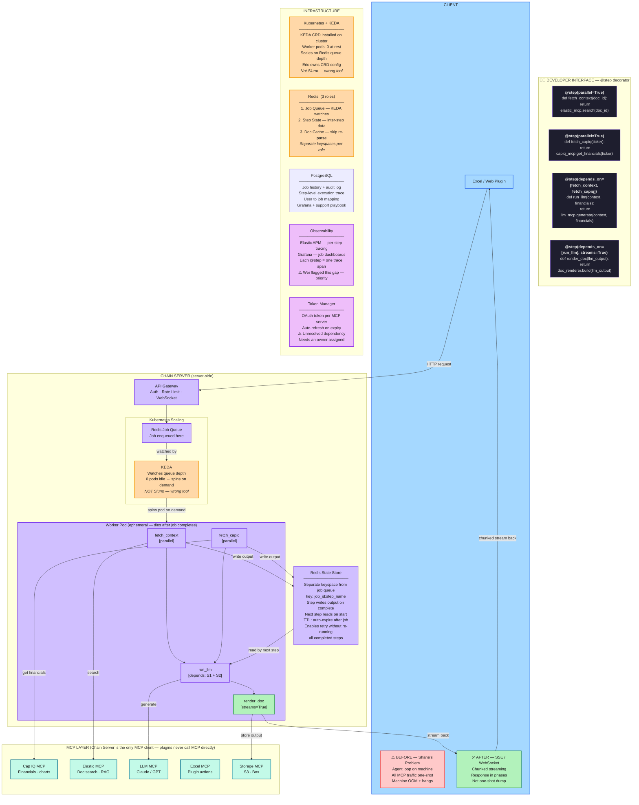

# AgentOrchestrator — Architecture Overview

```mermaid
graph TB
    subgraph DEV["🧑‍💻 DEVELOPER INTERFACE — @step decorator"]
        direction LR
        C1["<b>@step(parallel=True)</b><br/>def fetch_context(doc_id):<br/>  return elastic_mcp.search(doc_id)"]
        C2["<b>@step(parallel=True)</b><br/>def fetch_capiq(ticker):<br/>  return capiq_mcp.get_financials(ticker)"]
        C3["<b>@step(depends_on=[fetch_context, fetch_capiq])</b><br/>def run_llm(context, financials):<br/>  return llm_mcp.generate(context, financials)"]
        C4["<b>@step(depends_on=[run_llm], streams=True)</b><br/>def render_doc(llm_output):<br/>  return doc_renderer.build(llm_output)"]
    end

    subgraph CLIENT["CLIENT"]
        PLUGIN["Excel / Web Plugin"]
        BEFORE["⚠️ BEFORE — Shane's Problem<br/>Agent loop on machine<br/>All MCP traffic one-shot<br/>Machine OOM + hangs"]
        SSE["✅ AFTER — SSE / WebSocket<br/>Chunked streaming<br/>Response in phases<br/>Not one-shot dump"]
    end

    subgraph CHAIN["CHAIN SERVER  (server-side)"]
        GW["API Gateway<br/>Auth · Rate Limit · WebSocket"]

        subgraph SCALING["Kubernetes Scaling"]
            QUEUE["Redis Job Queue<br/>Job enqueued here"]
            KEDA["KEDA<br/>Watches queue depth<br/>0 pods idle → spins on demand<br/><i>NOT Slurm — wrong tool</i>"]
        end

        subgraph WORKER["Worker Pod  (ephemeral — dies after job completes)"]
            direction TB
            S1["fetch_context<br/>[parallel]"]
            S2["fetch_capiq<br/>[parallel]"]
            S3["run_llm<br/>[depends: S1 + S2]"]
            S4["render_doc<br/>[streams=True]"]

            S1 --> S3
            S2 --> S3
            S3 --> S4
        end

        STATE["Redis State Store<br/>────────────────<br/>Separate keyspace from job queue<br/>key: job_id:step_name<br/>Step writes output on complete<br/>Next step reads on start<br/>TTL: auto-expire after job<br/>Enables retry without re-running<br/>all completed steps"]
    end

    subgraph MCP["MCP LAYER  (Chain Server is the only MCP client — plugins never call MCP directly)"]
        direction TB
        MCPCIQ["Cap IQ MCP<br/>Financials · charts"]
        MCPELAS["Elastic MCP<br/>Doc search · RAG"]
        MCPLLM["LLM MCP<br/>Claude / GPT"]
        MCPEXCEL["Excel MCP<br/>Plugin actions"]
        MCPS3["Storage MCP<br/>S3 · Box"]
    end

    subgraph INFRA["INFRASTRUCTURE"]
        direction LR
        K8S["Kubernetes + KEDA<br/>────────────────<br/>KEDA CRD installed on cluster<br/>Worker pods: 0 at rest<br/>Scales on Redis queue depth<br/>Eric owns CRD config<br/><i>Not Slurm — wrong tool</i>"]
        REDIS["Redis  (3 roles)<br/>────────────────<br/>1. Job Queue — KEDA watches<br/>2. Step State — inter-step data<br/>3. Doc Cache — skip re-parse<br/><i>Separate keyspaces per role</i>"]
        PG["PostgreSQL<br/>────────────────<br/>Job history + audit log<br/>Step-level execution trace<br/>User to job mapping<br/>Grafana + support playbook"]
        OBS["Observability<br/>────────────────<br/>Elastic APM — per-step tracing<br/>Grafana — job dashboards<br/>Each @step = one trace span<br/>⚠️ Wei flagged this gap — priority"]
        TOKEN["Token Manager<br/>────────────────<br/>OAuth token per MCP server<br/>Auto-refresh on expiry<br/>⚠️ Unresolved dependency<br/>Needs an owner assigned"]
    end

    %% Client → Chain Server
    PLUGIN -->|"HTTP request"| GW
    SSE -->|"chunked stream back"| PLUGIN

    %% Gateway → Queue → KEDA → Worker
    GW --> QUEUE
    QUEUE -->|"watched by"| KEDA
    KEDA -->|"spins pod on demand"| WORKER

    %% Worker steps → Redis State
    S1 -->|"write output"| STATE
    S2 -->|"write output"| STATE
    STATE -->|"read by next step"| S3

    %% Worker → MCP calls
    S1 -->|"search"| MCPELAS
    S2 -->|"get financials"| MCPCIQ
    S3 -->|"generate"| MCPLLM
    S4 -->|"store output"| MCPS3
    S4 -->|"stream back"| SSE

    %% Styling
    classDef problem fill:#ffc9c9,stroke:#ef4444,stroke-width:2px,color:#1e1e1e
    classDef solution fill:#b2f2bb,stroke:#15803d,stroke-width:2px,color:#1e1e1e
    classDef server fill:#d0bfff,stroke:#7c3aed,stroke-width:2px,color:#1e1e1e
    classDef mcp fill:#c3fae8,stroke:#0e7490,stroke-width:2px,color:#1e1e1e
    classDef warning fill:#ffd8a8,stroke:#f59e0b,stroke-width:2px,color:#1e1e1e
    classDef critical fill:#eebefa,stroke:#9333ea,stroke-width:2px,color:#1e1e1e
    classDef client fill:#a5d8ff,stroke:#2563eb,stroke-width:2px,color:#1e1e1e
    classDef code fill:#1e1e2e,stroke:#8b5cf6,stroke-width:1px,color:#e5e5e5

    class BEFORE problem
    class SSE,S4 solution
    class GW,QUEUE,WORKER,S1,S2,S3,STATE server
    class MCPCIQ,MCPELAS,MCPLLM,MCPEXCEL,MCPS3 mcp
    class KEDA,K8S,REDIS warning
    class TOKEN,OBS critical
    class PLUGIN,CLIENT client
    class C1,C2,C3,C4 code
```
